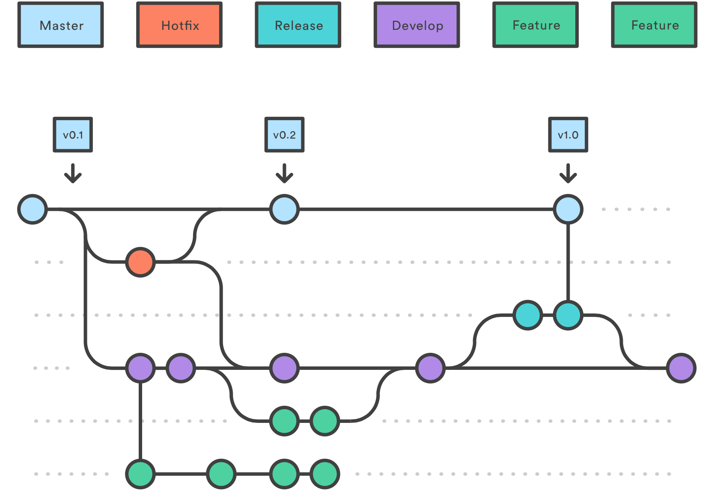

Distant Reading I: hacker les humanités

# Git

Simon Gabay
Genève

---

Des machines virtuelles avec linux sont disponibles à l'adresse suivante:

https://vdi.unige.ch

Le cours se déroulera sur ces machines, qui utilisent LINUX.

---

# Introduction

---
## Git

Git est un logiciel de gestion de versions décentralisé.

C'est un logiciel libre créé par Linus Torvalds, auteur du noyau Linux, et distribué selon les termes de la licence publique générale GNU version 2.

Il a des équivalents plus (CVS, SVN) ou moins (_Mercurial_, _Bazaar_) connus.

---
## Services en ligne
Des entreprises et des structures du public fournissent des serveurs centralisés pour git:
* _Github_ qui est le plus à la mode et que nous utiliserons
* _Gitlab_ qui est le concurrent le plus sérieux de github aujourd'hui
* _Bitbucket_
* _Forge_ pour le CNRS

---
## Objectifs
À partir de ces documents, les besoins éprouvés peuvent être :
* Organiser les versions d'un même document
* Pouvoir revenir en arrière, avoir une "trace"
* Permettre le travail collaboratif

---
## Principes généraux
1. Travail dans un _repository_ (dépôt en français) == un dossier (qui peut contenir d'autres dossiers)
	* Il contient un dossier (souvent caché) .git qui contient toutes les archives enregistrées
2. Contrairement à _Dropbox_ ou _Google Drive_, pour qu'une modification soit archivée, il faut que cela soit explicité
    * Ces modifications archivées sont appelées _commit_
    * Elles portent un message enregistré par l'utilisateur
    * Elles peuvent comporter plusieurs fichiers
    * Les fichiers qui ont subi des modifications doivent y être ajoutés explicitement

---
## Fonctionnement

On distingue trois "états" des fichiers
* un état de travail: le fichier a subi des modifications, mais nous ne l'avons pas encore ajouté (`add`) à un futur commit
* un état de futur enregistrement: le fichier a été ajouté (`add`) à un commit, mais le commit n'a pas été finalisé
* un état archivé: le fichier a subi des modifications enregistrées et n'a pas été modifié depuis lors.


---
## Fonctionnement


---
## Branches

Créer une branche, c’est en quelque sorte comme créer une “copie” du projet (donc du _repository_ entier) pour développer et tester de nouvelles fonctionnalités sans impacter le projet de base.

Pour simplifier au maximum, l'intérêt de git est de ne pas copier tout le fichier, mais d'identifier ce qui a changé. Il est ainsi très simple de faire une copie de travail, effectuer les modifications, et une fois les tests effectués de fusionner les fichiers.

On va donc distinguer la branche _master_ des autres branches.

---



[Source](https://blog.engineering.publicissapient.fr/2018/03/28/gitflow-est-il-le-workflow-dont-jai-besoin/)

---
# En pratique

---
## Au préalable

Ouvrir un compte sur _GitHub_ ou un _GitLab_ (comme celui de l'UniGE).

---
## Installation mac

Installer _homebrew_

```console
/usr/bin/ruby -e "$(curl -fsSL https://raw.githubusercontent.com/Homebrew/install/master/install)"
```

Installer git

```console
brew install git
```

On verifie que tout est en ordre:
```console
git --version
```
---
## Installation linux

On update l'index des package
```console
sudo apt update
```

On installe git:
```console
sudo apt install git
```
On verifie que tout est en ordre:
```console
git --version
```

---
## Configuration du compte

Il faut configurer le compte (remplacer par votre nom ou pseudo)

```console
git config --global user.name "Simon Gabay"
git config --global user.email "gabays@unige.ch"
```

---
## Créer un dossier

1. Naviguer à l'endroit voulu (on se rappelle les commandes `cd`, `ls`, `pwd`…)

2. Créer un dossier
```console
mkdir test
cd test
````

3. Créer un fichier
```console
echo "première tentative de faire un repo" >> README.md
```

Ce fichier est en _Markdown_ (cf. `.md`)

---
## Digression sur _markdown_

_Markdown_ est un langage simple de balisage pour mettre en forme les documents en ligne
1. C'est un fichier texte simple (`.txt`)
2. On met en gras avec deux étoiles `**`
3. On met en italique avec un underscore `_`
4. On hiérarchise les titres avec des `#`
5. On peut faire des listes
6. On peut ajouter du html à l'intérieur
7. … Cf. un cours en ligne ([exemple](https://openclassrooms.com/fr/courses/1304236-redigez-en-markdown)).

```markdown
C'est **en gras** et _en italique_
# Titre de niveau 1
## Titre de niveau 2 (sous-titre)
### Titre de niveau 3 (sous-sous-titre)
* item 1
* item 2
```

---
## Transformer le dossier en _repository_ 

1. Sur _GitHub_ cliquez sur l'onglet _Repositories_ et cliquez sur _New_
2. Choisissez un nom pour le _Repository_ et cliquez sur _Create_
3. Dans le terminal de votre ordinateir, allez dans le dossier que vous voulez synchroniser avec _GitHub_ et

```console
git init
git add [CHEMIN-VERS-FICHIER]
git commit -m "first commit"
git remote add origin [METTRE-LA-BONNE-ORIGINE]
git push --set-upstream origin master 
```

NOTE: Ici nous utilisons un serveur distant, mais il est possible de travailler en local

```console
git init faux-depot-distant --bare
```

---
## Mettre à jour le _repository_

Vérifier si le _repository_ est à jour:

```console
git status
```

Si des changements ont été effectués sur le _repository_ en ligne (ce n'est pas encore le cas)

```console
git pull
```

copier un repo:

```console
git clone [METTRE-L'URL]
```

---
## Ajouter un fichier

1. Modifier le fichier test (avec nano par exemple)
```console
git nano [CHEMIN-VERS-FICHIER]
```

2. Observer les changements
```console
git diff [CHEMIN-VERS-FICHIER]
```

3. Mettre à jour le fichier
```console
git add [CHEMIN-VERS-FICHIER]
```

3. faire un commit
```console
git commit -m "[INFORMATIONS-SUR-LE-CHANGEMENT]"
```

4. puis faire un push: c'est en ligne
```console
git push
```

---
## Ajouter une branche

1. On peut créer une branche
```console
git branch [NOM-DE-LA-BRANCHE]
````
2. On doit désormais basculer sur cette branche
```console
git checkout [NOM-DE-LA-BRANCHE]
```
3. On peut faire les deux opérations simultanément
```console
git checkout -b [NOM-DE-LA-BRANCHE]
```

---
## Travailler sur deux branches
1. On peut modifier `README.md`
```console
git add [CHEMIN-VERS-FICHIER]
git commit -m "[INFORMATIONS-SUR-LE-CHANGEMENT]"
git push --set-upstream origin [NOM-DE-LA-BRANCHE]
```
2. Maintenant basculez sur master
```console
git checkout master
```
3. Regardez le contenu de votre dossier, et regarder votre _repository en ligne_
4. Intégrez les "résultats" de la branche `dev`
```console
git merge [NOM-DE-LA-BRANCHE]
```
---
### Plus d'information

Cf. [openclassroom](https://openclassrooms.com/fr/courses/1233741-gerez-vos-codes-source-avec-git) pour un cours plus complet