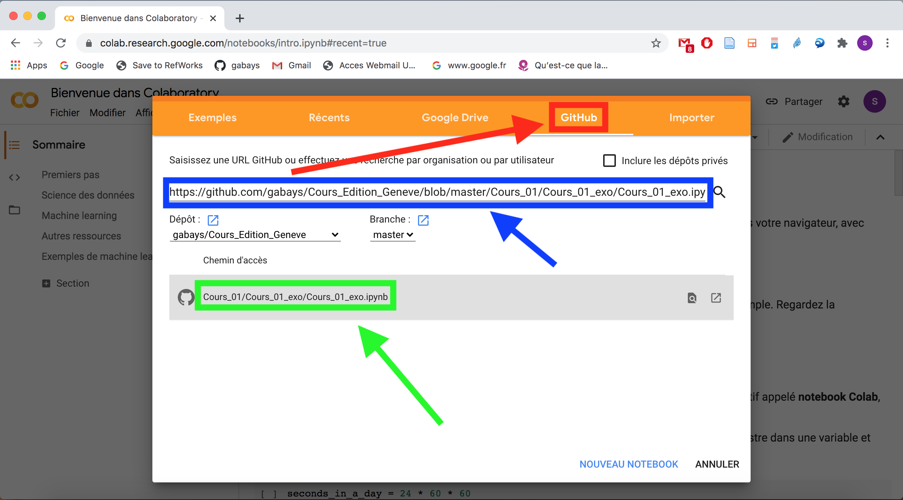

Formation Edition numérique

# OCR

Simon Gabay

---

Le _notebook_ est préparé pour fonctionner avec le service en ligne _Colab_ de Google.

1. Allez à l'adresse suivante: https://colab.research.google.com . (si possible en utilisant le navigateur _Chrome_).

2. Sélectionnez l'onglet `GitHub`

3. Copiez le lien suivant: `https://github.com/gabays/DistRead_1/blob/master/DistRead_1_4/DistRead_1_4.ipynb`

4. Supprimez tous les éléments de sortie

