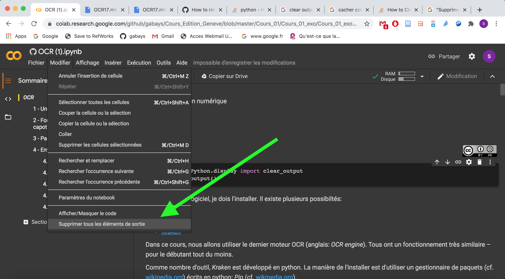

Distant Reading I: hacker les humanités

# Algoritmique: charger le notebook

Simon Gabay
Genève

---

## Avec un environnement virtuel
1. Télécharger le cours
```console
git clone https://github.com/gabays/DistRead_1
```
2. Aller au cours 4
```console
cd DistRead_1/DistRead_1_5
```
3. Créer un environnement virtuel
```console
pip install virtualenv
virtualenv env
```
4. Activer l'environnement virtuel
```console
source env/bin/activate
```
5. Installer les packages nécessaires
```console
pip install -r requirements.txt
```
6. Lancez le notebook
```python
jupyter notebook
```
7. Pour arrêter Jupyter notebook: cmd+C ou Ctrl+C
8. Pour fermer l'environnement virtuel
```
deactivate
```
---
## Avec _Colab_

Le _notebook_ est préparé pour fonctionner avec le service en ligne _Colab_ de Google.

1. Allez à l'adresse suivante: https://colab.research.google.com . (si possible en utilisant le navigateur _Chrome_).

2. Sélectionnez l'onglet `GitHub`

3. Copiez le lien suivant: `https://github.com/gabays/DistRead_1/blob/master/DistRead_1_5/DistRead_1_5.ipynb`


4. Supprimez tous les éléments de sortie


